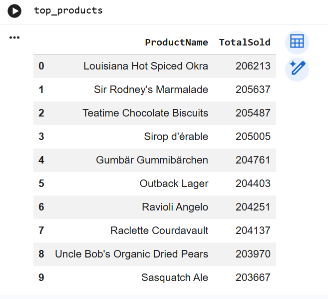
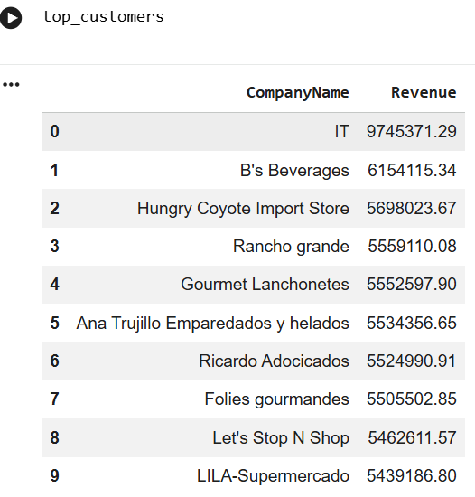
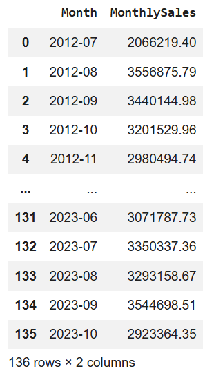
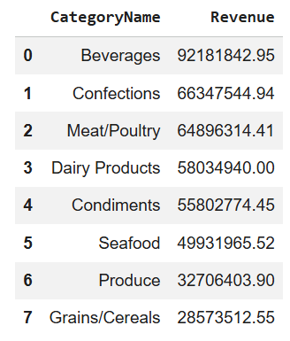
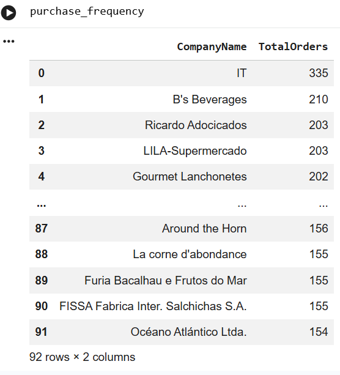

# Northwind Sales Analysis

A SQL + pandas case study on the Northwind trading company database — a classic
"orders, products, customers" dataset used to practice business analytics.

## Database Overview

Northwind simulates a small import/export company selling specialty foods.
The tables relevant to this analysis:

| Table | Purpose |
|---|---|
| `Orders` | One row per order (customer, employee, date, ship info) |
| `Order Details` | Line items per order (product, quantity, unit price, discount) |
| `Products` | Product catalog (name, category, supplier, price) |
| `Categories` | Product category names |
| `Customers` | Customer company info and country |

## Business Questions

1. Which are the top 10 best-selling products based on the total quantity sold?

2. Which customers generate the highest revenue for the company?

3. How do sales performance and revenue change month by month?

4. Which product categories contribute the most revenue to the business?

5. Which customers purchase most frequently and show strong customer loyalty?

## Business Insights

1. Highest selling product: Louisiana Hot Spiced Okra
   Quantity sold: 206213
2. Top 10 products account for 39.47% of total revenue"
3. Highest sales month: 2021-12
   Sales: 4377795.399999986
4. Best category: Beverages
   Revenue: 92181842.95
5. Highest revenue customer: IT 
   Revenue: 9745371.289999997
## SQL Output Screenshots

### Top 10 Selling Products

### Top Customers by Revenue

### Monthly Sales Trend

### Best Product Categories

### Customer Purchase Frequency

